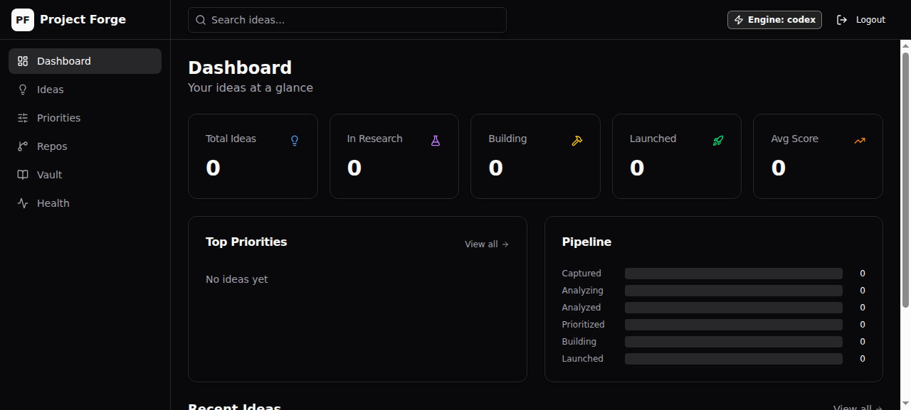
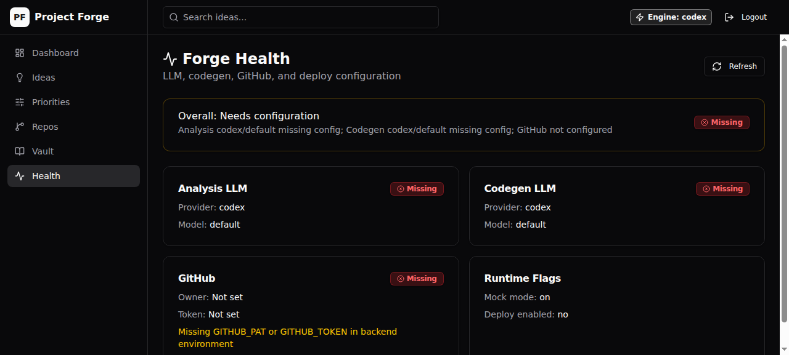
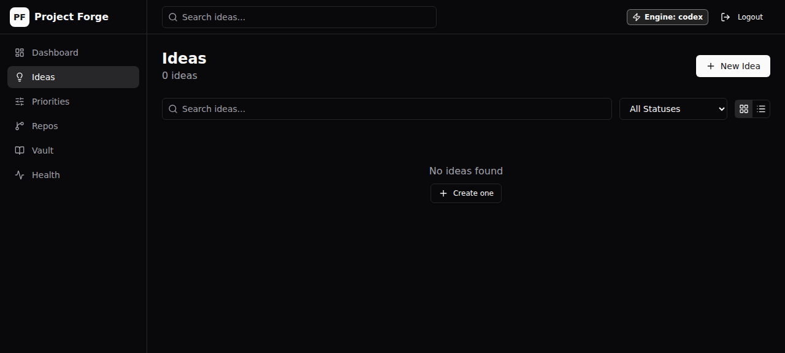
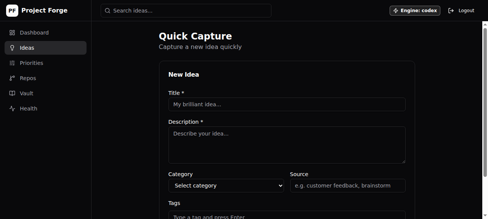
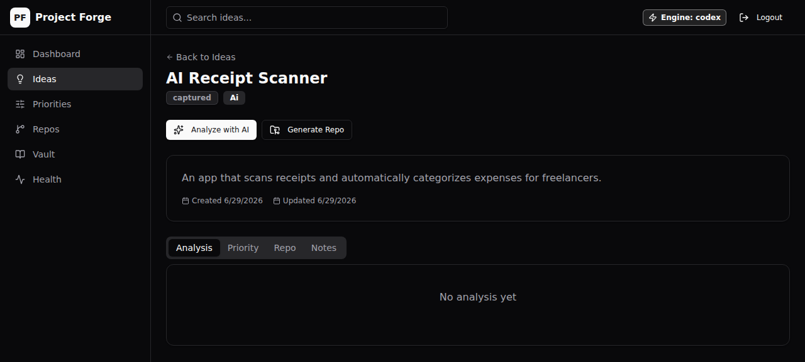
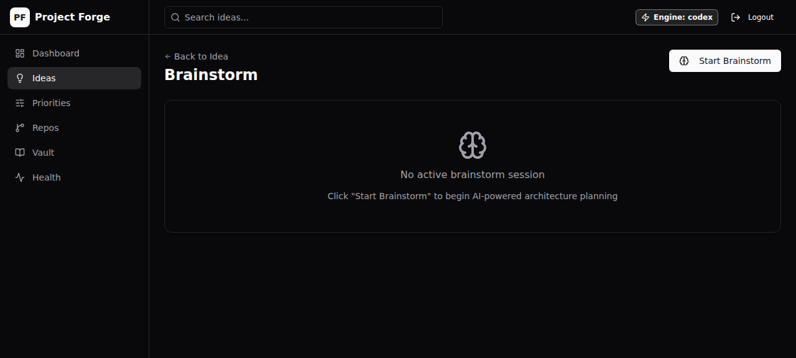
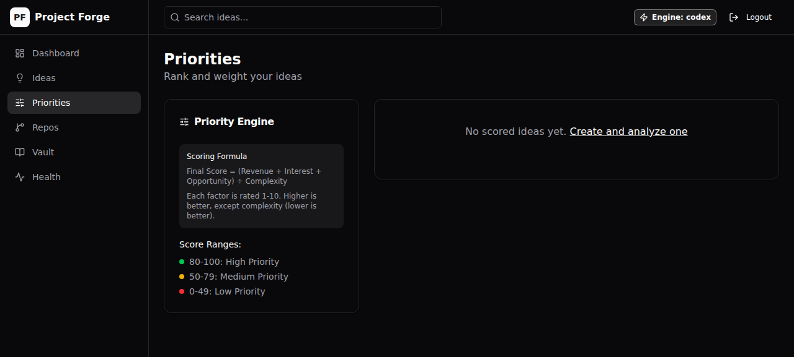
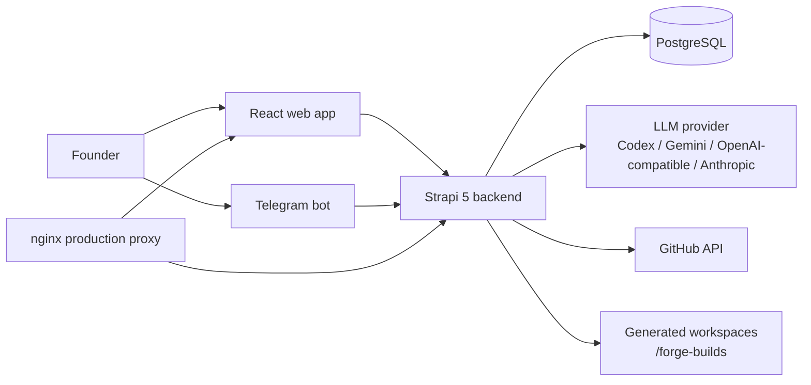

# Project Forge

**AI-powered second brain for founders: capture ideas, analyse them, refine architecture, and turn the best ones into buildable repositories.**

Project Forge is a self-hosted product-building workspace. It combines a React dashboard, Strapi CMS, PostgreSQL, configurable LLM providers, GitHub delivery, and an optional Telegram bot.


## Why it exists

Founders often have too many half-formed ideas and no repeatable path from capture → validation → build plan → shipped prototype. Project Forge makes that workflow explicit:

1. Capture ideas from the web app or Telegram.
2. Analyse viability, market, risks, and technical complexity with a real LLM provider.
3. Compare/prioritise ideas with a scoring model.
4. Brainstorm architectures and clarify requirements.
5. Generate implementation layers and push starter repos to GitHub.
6. Track notes, repo links, build progress, and refinement requests.

## Features

| Area | What works |
|---|---|
| Idea workspace | Create, search, view, and categorise ideas. Grid/list UI. |
| AI analysis | Configurable LLM analysis with strict JSON handling. No silent mock fallback unless `MOCK_MODE=1`. |
| Prioritisation | Score ideas with revenue × interest × opportunity ÷ complexity. |
| Brainstorm flow | Architecture proposals, selection, clarifying questions, build steps. |
| GitHub delivery | Creates repositories and pushes generated files through the GitHub REST/Git Data API. No local `gh` required. |
| Health visibility | `/api/forge/health` reports actual active providers, models, GitHub status, deploy mode, and mock mode. |
| Telegram capture | Optional bot for idea capture and build workflow commands. |
| Docker-first | Local development and production compose files. |

## Screenshots

| Screen | Preview |
|---|---|
| Dashboard |  |
| Health |  |
| Ideas |  |
| New Idea |  |
| Idea Detail |  |
| Brainstorm |  |
| Priorities |  |

> Screenshots captured during a `MOCK_MODE=1` demo run. See `docs/open-source-submission.md` for the demo script.

## Screens / important routes

| Route | Purpose |
|---|---|
| `/dashboard` | Overview, stats, recent ideas, top priorities. |
| `/ideas` | Idea library with filtering and grid/list views. |
| `/ideas/new` | Create idea. |
| `/ideas/:id` | Analysis, priority, repo, and notes. |
| `/ideas/:id/brainstorm` | Architecture/Q&A/build workflow. |
| `/priorities` | Ranked leaderboard. |
| `/vault` | Cross-idea notes. |
| `/health` | Human-readable engine/GitHub/deploy status. |

## Tech stack

| Layer | Tech |
|---|---|
| Frontend | React 19, TypeScript, Vite, Tailwind CSS, ShadCN-style components, Lucide icons |
| Backend | Strapi 5, custom REST routes, GraphQL plugin |
| Database | PostgreSQL 16 |
| AI | Codex CLI, Gemini, OpenAI-compatible APIs, Anthropic, or custom CLI providers |
| Delivery | GitHub REST + Git Data API |
| Bot | Python Telegram bot |
| Infra | Docker Compose, nginx for production reverse proxy |

## Architecture



More detail: [`docs/architecture.md`](docs/architecture.md).

## Quick start

### Requirements

- Docker + Docker Compose
- Node.js 20+ if running tests/builds outside Docker
- Python 3.11+ and `pytest` for bot tests
- Optional: Codex CLI or API keys for Gemini/OpenAI-compatible/Anthropic providers
- Optional: GitHub PAT for repository generation
- Optional: Telegram bot token

### 1. Clone

```bash
git clone https://github.com/ankush-kaura/project-forge.git
cd project-forge
```

### 2. Configure environment

```bash
cp .env.example .env
```

Then edit `.env`. Minimum local values:

```env
DATABASE_HOST=database
DATABASE_PORT=5432
DATABASE_NAME=project_forge
DATABASE_USERNAME=forge
DATABASE_PASSWORD=forge

NODE_ENV=development
PORT=1337
VITE_API_URL=http://localhost:1337

# Use mock mode only for local demos without an LLM provider.
MOCK_MODE=1
FORGE_DEPLOY_ENABLED=0
```

For real AI, set one provider instead of `MOCK_MODE=1`.

#### Codex CLI provider

```env
LLM_PROVIDER=codex
CODEGEN_PROVIDER=codex
CODEX_COMMAND=codex
CODEX_MODEL=
CODEX_SANDBOX=read-only
CODEX_TIMEOUT_MS=300000
MOCK_MODE=0
```

#### OpenAI-compatible provider

Useful for local gateways or budget providers:

```env
LLM_PROVIDER=openai
CODEGEN_PROVIDER=openai
OPENAI_API_KEY=your-key
OPENAI_BASE_URL=https://api.example.com/v1
OPENAI_MODEL=gpt-4o-mini
OPENAI_ANALYSIS_MODEL=gpt-4o-mini
OPENAI_CODEGEN_MODEL=gpt-4o
CODEGEN_MODEL=gpt-4o
MOCK_MODE=0
```

#### Gemini provider

```env
LLM_PROVIDER=gemini
CODEGEN_PROVIDER=gemini
GEMINI_API_KEY=your-key
GEMINI_ANALYSIS_MODEL=gemini-2.0-flash
CODEGEN_MODEL=gemini-1.5-pro
MOCK_MODE=0
```

#### GitHub delivery

```env
GITHUB_PAT=github_pat_or_classic_token
GITHUB_OWNER=optional-owner-or-org
```

The token needs repository creation/content permissions. Fine-grained tokens should allow repository administration and contents read/write for the target account/org.

### 3. Start

```bash
docker compose up -d --build
```

Local URLs:

| Service | URL |
|---|---|
| Web app | http://localhost:3000 |
| Strapi admin | http://localhost:1337/admin |
| API health | http://localhost:1337/api/forge/health |
| GraphQL | http://localhost:1337/graphql |

Check status:

```bash
docker compose ps
curl http://localhost:1337/api/forge/health
```

## Development commands

### All services

```bash
docker compose up -d --build
docker compose logs -f
docker compose down
```

### Backend

```bash
cd backend
npm ci
npm test -- --run
npm run build
```

### Frontend

```bash
cd frontend
npm ci
npm test -- --run
npm run build
```

### Telegram bot

```bash
cd telegram-bot
python -m pip install pytest
pytest -q
```

## Production deployment

Production compose includes nginx and expects `.env` to define your domain/secrets.

```bash
cp .env.example .env
# edit DOMAIN, database credentials, Strapi secrets, provider keys, GitHub token, etc.
./deploy.sh
```

`deploy.sh` generates local self-signed TLS files under `nginx/ssl/` when missing. These are intentionally ignored by Git.

For real public hosting, replace self-signed certs with certificates from your reverse proxy/ACME setup.

## Important API endpoints

| Method | Path | Purpose |
|---|---|---|
| `GET` | `/api/forge/health` | Provider/GitHub/deploy status. |
| `POST` | `/api/ideas/:id/analyze` | Run LLM idea analysis. |
| `POST` | `/api/ideas/:id/prioritize` | Calculate priority score. |
| `POST` | `/api/ideas/:id/generate-repo` | Create/push starter GitHub repo. |
| `POST` | `/api/brainstorm/:ideaId` | Start architecture brainstorm. |
| `GET` | `/api/brainstorm/idea/:ideaId/active` | Get active brainstorm session for idea. |
| `POST` | `/api/brainstorm/:sessionId/choose` | Choose architecture option. |
| `POST` | `/api/brainstorm/:sessionId/approve-architecture` | Generate clarification questions. |
| `GET` | `/api/brainstorm/:sessionId/questions` | Fetch Q&A questions. |

## Telegram bot

Set:

```env
TELEGRAM_TOKEN=your-bot-token
ALLOWED_USERS=comma-separated-telegram-user-ids
STRAPI_URL=http://backend:1337
```

Common commands:

| Command | Purpose |
|---|---|
| `/new <title> — <description>` | Create idea. |
| `/list` | Recent ideas. |
| `/analyze <id>` | Trigger analysis. |
| `/brainstorm <id>` | Start architecture brainstorming. |
| `/choose <session-id> <number>` | Pick architecture. |
| `/approve_arch <session-id>` | Approve architecture and generate questions. |
| `/start_qa <session-id>` | Start Q&A. |
| `/status <id>` | Idea/session status. |

## Testing

- Backend: `22 passed, 1 skipped`
- Frontend: `6 passed`, production build passed
- Telegram bot: `8 passed`
- Backend Strapi production build passed
- `docker compose config --quiet` passed

## Security

- Real `.env` files are ignored.
- Local TLS keys/certs under `nginx/ssl/` are ignored.
- Do not commit provider API keys, GitHub PATs, Telegram bot tokens, Strapi secrets, or production database credentials.
- Report security issues privately; see [`SECURITY.md`](SECURITY.md).

## License

MIT — see [`LICENSE`](LICENSE).
