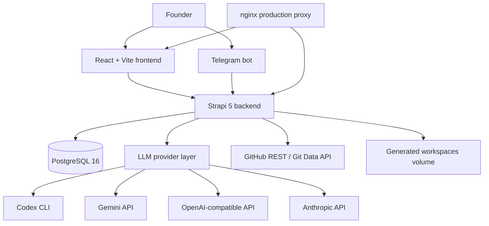

# Architecture

Project Forge is a Docker-first founder workspace that turns idea capture into structured analysis, architecture refinement, and generated starter repositories.

## System diagram

## Main components

| Component | Path | Responsibility |
|---|---|---|
| Frontend | `frontend/src` | Auth shell, dashboard, idea pages, brainstorm UI, health UI. |
| Strapi backend | `backend/src` | Content types and custom product-flow REST routes. |
| LLM layer | `backend/src/lib/llm.ts` | Provider selection, schema-constrained JSON calls, Codex subprocess runner, no silent fallback. |
| GitHub layer | `backend/src/lib/github.ts` | Creates repos and commits generated files using GitHub APIs. |
| Verification helpers | `backend/src/lib/verify.ts` | Writes generated layers and runs verification checks. |
| Deployment helper | `backend/src/lib/deploy.ts` | Optional generated-app deployment hooks. |
| Telegram bot | `telegram-bot/bot.py` | Idea capture and workflow commands from Telegram. |
| nginx | `nginx/nginx.conf` | Production reverse proxy. |

## Data model summary

Strapi content types include:

- `idea`
- `analysis`
- `priority`
- `repo`
- `note`
- `brainstorm-session`
- `clarifying-question`
- `build-step`
- `refinement-request`

## Flow

1. User creates an idea.
2. Backend analysis route calls the configured LLM provider.
3. Result is parsed as JSON and stored as an `analysis` record.
4. User can score priority or start brainstorm.
5. Brainstorm creates architecture options and clarification questions.
6. Build-layer generation writes files into the generated workspace volume.
7. GitHub delivery can create a repository and push generated files.
8. Health endpoint exposes whether the system is using real providers or mock mode.

## LLM provider contract

`backend/src/lib/llm.ts` supports:

- `codex`
- `gemini`
- `openai`
- `anthropic`
- `custom-cli`
- `factory-droid`

Important behavior:

- Provider choice is controlled by environment variables.
- Analysis and codegen can use different providers.
- `callLLMJson()` throws on invalid/missing JSON.
- Mock generators only run when `MOCK_MODE=1`.
- `/api/forge/health` reports actual configured providers/models.

## GitHub delivery contract

`backend/src/lib/github.ts` uses GitHub REST/Git Data APIs instead of shelling out to `gh` or `git`.

Required environment:

- `GITHUB_PAT` or `GITHUB_TOKEN`
- Optional `GITHUB_OWNER`

The token must allow repository creation and contents write access.

## Deployment notes

- Local development binds app ports to `127.0.0.1`.
- Production compose exposes nginx on `80/443`.
- Self-signed TLS files under `nginx/ssl/` are local artifacts and ignored.
- Generated workspaces are mounted outside the Strapi watched tree to avoid dev-server restarts.
